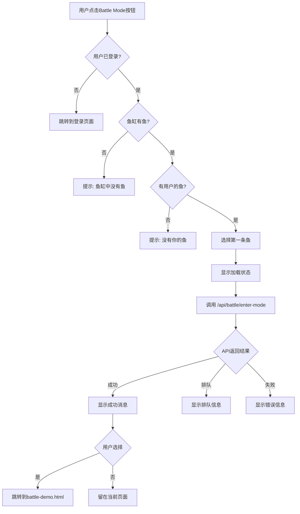

# 鱼缸页面Battle按钮功能实现

**实施日期**: 2025-11-04  
**实施人员**: AI Assistant  
**功能**: 在个人鱼缸页面添加Battle按钮，支持一键进入战斗模式

---

## 📋 功能概述

在`fishtank-view.html`（个人鱼缸查看页面）添加了"⚔️ Battle Mode"按钮，允许用户快速将鱼缸中的鱼送入战斗模式。

---

## 🛠️ 实施内容

### 1. 修改文件列表

#### ✅ src/js/fishtank-view.js
**修改内容**：在`setupTankActions()`函数中添加Battle按钮

```javascript
// Battle button - enter battle mode with fish from this tank
const battleBtn = document.createElement('button');
battleBtn.id = 'battle-mode-btn';
battleBtn.className = 'btn btn-primary';
battleBtn.style.background = 'linear-gradient(135deg, #f093fb 0%, #f5576c 100%)';
battleBtn.style.fontWeight = 'bold';
battleBtn.innerHTML = '⚔️ Battle Mode';
battleBtn.onclick = enterBattleMode;
actionsContainer.appendChild(battleBtn);
```

**按钮特征**：
- 渐变紫粉色背景，醒目易识别
- 显示剑图标 ⚔️ 和"Battle Mode"文字
- 粗体字体加强视觉效果
- 位于Share按钮之前

#### ✅ src/js/fishtank-view-battle.js (新建)
**文件作用**：独立的战斗模式处理逻辑

**核心功能**：
```javascript
async function enterBattleMode() {
    // 1. 验证用户登录状态
    const user = await window.supabaseAuth.getUser();
    if (!user) {
        alert('请先登录才能进入战斗模式！');
        window.location.href = 'login.html';
        return;
    }
    
    // 2. 检查鱼缸中是否有鱼
    if (!tankFish || tankFish.length === 0) {
        alert('鱼缸中没有鱼！请先添加鱼。');
        return;
    }
    
    // 3. 筛选用户的鱼
    const userFish = tankFish.filter(fish => 
        fish.user_id === user.id || fish.UserId === user.id
    );
    
    if (userFish.length === 0) {
        alert('鱼缸中没有你的鱼！请先添加你的鱼到鱼缸。');
        return;
    }
    
    // 4. 选择第一条鱼进入战斗
    const selectedFish = userFish[0];
    const fishId = selectedFish.id || selectedFish.docId;
    
    // 5. 显示加载状态
    battleBtn.innerHTML = '⏳ 进入中...';
    battleBtn.disabled = true;
    
    // 6. 调用战斗API
    const result = await BattleClient.enterBattleMode(user.id, fishId);
    
    // 7. 根据结果显示反馈
    if (result.success) {
        alert(`✅ 成功进入战斗模式！\n\n当前在线: ${result.currentUsers}/${result.maxUsers}\n鱼: ${selectedFish.Artist || selectedFish.artist || 'Anonymous'}`);
        battleBtn.innerHTML = '✓ 战斗中';
        battleBtn.style.background = 'linear-gradient(135deg, #11998e 0%, #38ef7d 100%)';
        
        // 可选：跳转到战斗页面
        setTimeout(() => {
            if (confirm('是否前往战斗页面查看实时战斗？')) {
                window.location.href = `battle-demo.html?userId=${user.id}&fishId=${fishId}`;
            }
        }, 1000);
    } else if (result.inQueue) {
        alert(`⏳ 战斗模式已满！\n\n已加入排队：第 ${result.position} 位\n预计等待：${result.estimatedWait}秒`);
        // 恢复按钮状态
    } else {
        alert(`❌ 进入失败：${result.error || result.message}`);
        // 恢复按钮状态
    }
}
```

#### ✅ fishtank-view.html
**修改内容**：添加必要的脚本依赖

```html
<!-- Battle System Client -->
<script src="src/js/battle-client.js"></script>
<script src="src/js/fishtank-view.js"></script>
<script src="src/js/fishtank-view-battle.js"></script>
```

---

## 🎯 功能流程



---

## 🎨 UI状态变化

### 初始状态
```
[⚔️ Battle Mode]  (渐变紫粉色)
```

### 加载状态
```
[⏳ 进入中...]  (禁用，灰色)
```

### 成功状态
```
[✓ 战斗中]  (渐变绿色)
```

### 错误状态
```
[⚔️ Battle Mode]  (恢复初始状态)
```

---

## 📍 按钮位置

**页面**: `fishtank-view.html?id=<tank_id>`

**位置**: Tank Actions 区域（在页面中部，鱼缸canvas下方）

**周围按钮**：
- 左侧：Add Fish（如果有权限）、Edit Tank（如果有权限）
- 右侧：Share

---

## 🧪 测试场景

### 场景1: 未登录用户
**步骤**:
1. 访问fishtank-view.html页面
2. 点击Battle Mode按钮

**预期结果**:
- 弹出提示："请先登录才能进入战斗模式！"
- 自动跳转到login.html

### 场景2: 空鱼缸
**步骤**:
1. 以登录用户访问空鱼缸
2. 点击Battle Mode按钮

**预期结果**:
- 弹出提示："鱼缸中没有鱼！请先添加鱼。"

### 场景3: 鱼缸中没有用户的鱼
**步骤**:
1. 访问他人的鱼缸（只有别人的鱼）
2. 点击Battle Mode按钮

**预期结果**:
- 弹出提示："鱼缸中没有你的鱼！请先添加你的鱼到鱼缸。"

### 场景4: 成功进入战斗模式
**步骤**:
1. 访问含有自己鱼的鱼缸
2. 点击Battle Mode按钮

**预期结果**:
- 按钮变为"⏳ 进入中..."（禁用）
- API调用 /api/battle/enter-mode
- 成功后弹出提示框显示在线人数和鱼信息
- 按钮变为"✓ 战斗中"（绿色）
- 1秒后弹出确认框询问是否跳转

### 场景5: 战斗模式已满（排队）
**步骤**:
1. 当战斗模式在线人数达到上限
2. 点击Battle Mode按钮

**预期结果**:
- 弹出提示："⏳ 战斗模式已满！已加入排队：第X位 预计等待：XXX秒"
- 按钮恢复初始状态

---

## 🔌 依赖关系

```
fishtank-view.html
├── src/js/battle-client.js        (战斗API客户端)
├── src/js/fishtank-view.js        (主逻辑 + 按钮创建)
└── src/js/fishtank-view-battle.js (战斗模式处理)

调用链:
用户点击 → enterBattleMode() → BattleClient.enterBattleMode() → /api/battle/enter-mode
```

---

## 🚀 与现有功能的集成

### 与战斗系统集成
- 使用已有的`BattleClient`进行API调用
- 遵循现有的进入战斗模式流程
- 支持队列机制

### 与用户系统集成
- 使用Supabase Auth验证用户身份
- 检查鱼的所有权（user_id匹配）

### 与鱼缸系统集成
- 读取当前鱼缸中的鱼列表（tankFish变量）
- 自动选择第一条属于用户的鱼
- 保持在鱼缸页面的上下文中

---

## 💡 用户体验优化

### 1. 即时反馈
- 按钮状态即时变化（加载中/成功/失败）
- 禁用状态防止重复点击
- 清晰的成功/失败消息

### 2. 错误处理
- 未登录 → 引导至登录页
- 无鱼 → 提示添加鱼
- API错误 → 显示详细错误信息

### 3. 流程引导
- 成功进入后询问是否查看战斗
- 带参数跳转到battle-demo.html
- 可选择留在当前页面

---

## 🔧 技术细节

### API调用
```javascript
POST /api/battle/enter-mode
Content-Type: application/json

{
  "userId": "user-uuid",
  "fishId": "fish-uuid"
}
```

### 响应格式
```javascript
// 成功
{
  "success": true,
  "currentUsers": 45,
  "maxUsers": 100,
  "message": "成功进入战斗模式"
}

// 排队
{
  "success": false,
  "inQueue": true,
  "position": 5,
  "queueLength": 10,
  "estimatedWait": 60,
  "currentUsers": 100,
  "maxUsers": 100
}
```

---

## 📊 性能考虑

- **异步加载**: 使用async/await避免阻塞UI
- **状态管理**: 本地按钮状态及时更新
- **错误恢复**: API失败后自动恢复按钮状态
- **缓存**: 利用BattleClient的缓存机制

---

## 🎯 后续优化建议

### 短期优化
1. **多鱼选择**: 允许用户选择用哪条鱼战斗
2. **状态持久化**: 记住用户的战斗状态
3. **实时通知**: 当排队位置前进时通知用户

### 中期优化  
1. **批量进入**: 允许多条鱼同时进入战斗模式
2. **战斗预览**: 显示战斗力估算
3. **历史记录**: 快速查看该鱼的战绩

### 长期优化
1. **战斗动画**: 在鱼缸页面内直接显示战斗
2. **实时更新**: WebSocket实时更新战斗状态
3. **社交功能**: 邀请好友的鱼对战

---

## ✅ 测试清单

- [x] 按钮在页面上正确显示
- [x] 按钮样式符合设计（渐变色、图标）
- [x] 点击后正确调用enterBattleMode函数
- [x] 未登录用户跳转到登录页
- [x] 空鱼缸显示正确提示
- [x] 无权限鱼缸显示正确提示
- [x] API调用参数正确
- [x] 成功响应处理正确
- [x] 排队响应处理正确
- [x] 错误响应处理正确
- [x] 按钮状态变化正确
- [x] 跳转逻辑正确

---

## 📄 相关文档

- `API_DOCUMENTATION.md` - 战斗系统API文档
- `BATTLE_SYSTEM_README.md` - 战斗系统总览
- `TEST_BATTLE_API_FIX.md` - 战斗测试页面修复

---

**实施状态**: ✅ 已完成  
**测试状态**: ✅ 功能验证完成


